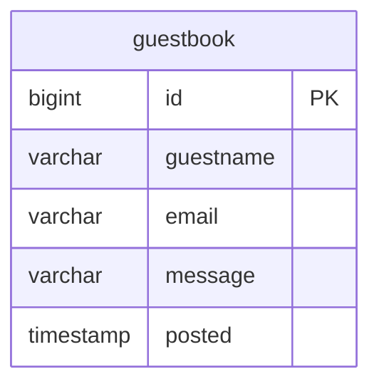
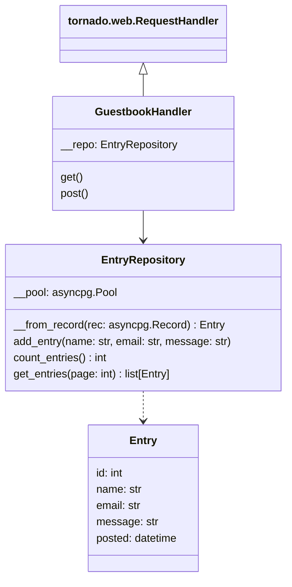

# Ein Gästebuch in Python mit Tornado und PostgreSQL

Ein Klassiker im Internet aus der Zeit vor dem Siegeszug der Sozialen Medien ist das Gästebuch. Was Anfang der 2000er noch bei vielen Homepages anzutreffen war ist heute auch wegen Spam und anderer unerwünschter Inhalte kaum noch zu finden. Ein Gästebuch zu erstellen ist allerdings eine gute Übung für den Einstieg in die Entwicklung von Webanwendungen.

Wir werden in diesem Tutorial das Gästebuch mit der Programmiersprache [Python](https://www.python.org/) in der Version 3.11 und dem [Tornado Web Server](https://www.tornadoweb.org/) mit der Version 6.4 entwickeln. Außerdem werden wir die Gästebucheinträge in einer [PostgreSQL](https://www.postgresql.org/) Datenbank speichern.

## Datenmodell

Jeder Gästebucheintrag wird als Datensatz bestehend aus den Werten `name`, `email`, `message` sowie einem automatischen Timestamp für den Zeitpunkt der Erstellung in einer Einzelnen Tabelle abgelegt. Die Tabelle wird außerdem eine automatisch vergebene numerische id als Primärschlüssel haben.



Eine Webanwendung sollte nicht mit dem Superuser auf die Datenbank zugreifen, also erstellen wir als Erstes einen neuen Datenbankbenutzer und ein dazu passendes Schema.

```postgresql
CREATE USER guestbook WITH PASSWORD 'trustno1';
GRANT CONNECT ON DATABASE postgres TO guestbook;
CREATE SCHEMA AUTHORIZATION guestbook;
```

Mit dem neu angelegten Datenbankbenutzer können wir jetzt in das ebenfalls neu angelegte Schema die Tabelle erstellen.

```postgresql
CREATE TABLE "entry" (
    "id" BIGINT GENERATED ALWAYS AS IDENTITY (START WITH 1 INCREMENT BY 1) PRIMARY KEY,
    "name" VARCHAR NOT NULL,
    "email" VARCHAR NOT NULL,
    "message" VARCHAR NOT NULL,
    "posted" TIMESTAMP(3) DEFAULT CURRENT_TIMESTAMP NOT NULL
);
```

## Tornado installieren und initialisieren

Um das Tornado-Webframework verwenden zu können müssen wir zuerst das Package in unserer Python-Umgebung installieren.

```
pip install -U tornado
```

Nachdem das Package installiert ist können wir das Grundgerüst einer Tornado-Anwendung erstellen. Wir erstellen ein `HTTPServer`-Objekt und übergeben dabei ein `Application`-Objekt, welches wiederum zu bestimmten Pfaden registrierte `RequestHandler` enthält. Tornado nutzt das `asyncio`-Package aus der Python-Standard-Library, also müssen wir die Initialisierung in eine Coroutine durchführen und diese beim Start des Event-Loops übergeben. Außerdem erlauben wir es den Port des Web-Servers per Kommandozeilenparameter angeben zu können.

```python
import asyncio
import logging

from tornado.httpserver import HTTPServer
from tornado.options import define, options, parse_command_line
from tornado.web import Application

define("port", default=8080, help="port to listen on")


async def main():
    app = Application()
    server = HTTPServer(app)
    logging.info('Start listening on port %d', options.port)
    server.listen(options.port)
    shutdown_event = asyncio.Event()
    await shutdown_event.wait()


if __name__ == '__main__':
    parse_command_line()
    try:
        asyncio.run(main())
    except KeyboardInterrupt:
        logging.info('Shutting down')
```

## PostgreSQL-Connection-Pool initialisieren

Um eine Verbindung zur Datenbank herstellen zu können brauchen wir ein weiteres Package, das wir zuerst installieren müssen.

```
pip install -U asyncpg
```

Wir initialisieren in der `main`-Funktion einen Connection-Pool. Jeder Request an das Gästebuch soll eine eigene Connection aus dem Pool verwenden um SQL-Statement an die Datenbank zu schicken.

```python
import asyncio
import logging

import asyncpg
from tornado.httpserver import HTTPServer
from tornado.options import define, options, parse_command_line
from tornado.web import Application

define("port", default=8080, help="port to listen on")
define("pgurl", default='postgres://postgres:@localhost:5432/postgres', help="PostgreSQL URL")


async def main():
    pool = await asyncpg.create_pool(options.pgurl)
    app = Application()
    server = HTTPServer(app)
    logging.info('Start listening on port %d', options.port)
    server.listen(options.port)
    shutdown_event = asyncio.Event()
    await shutdown_event.wait()
    await pool.close()


if __name__ == '__main__':
    parse_command_line()
    try:
        asyncio.run(main())
    except KeyboardInterrupt:
        logging.info('Shutting down')
```

## Gästebuch-Logik

Die eigentliche Logik des Gästebuchs implementieren wir in einem `GuestbookHandler`.
Außerdem werden wir eine `GuestbookRepository`-Klasse erstellen in der die Zugriffe auf die Datenbank
gekapselt werden.



```python
from datetime import datetime
from http import HTTPStatus

import asyncpg
from tornado.web import RequestHandler, HTTPError

MAX_ENTRIES_PER_PAGE = 5


class Entry:
    def __init__(self, id: int, name: str, email: str, message: str, posted: datetime):
        self.id = id
        self.name = name
        self.email = email
        self.message = message
        self.posted = posted


class EntryRepository:
    def __init__(self, pool: asyncpg.Pool):
        self.__pool = pool

    def __from_record(self, rec: asyncpg.Record) -> Entry:
        return Entry(rec['id'], rec['name'], rec['email'], rec['message'], rec['posted'])

    async def add_entry(self, name: str, email: str, message: str):
        await self.__pool.execute("""
                                  INSERT INTO "entry" ("name", "email", "message")
                                  VALUES ($1, $2, $3)
                                  """,
                                  name, email, message)

    async def count_entries(self) -> int:
        return (await self.__pool.fetchrow('SELECT count(*) AS total_entries FROM "entry"'))['total_entries']

    async def get_entries(self, page: int) -> list[Entry]:
        entries = await self.__pool.fetch("""
                                          SELECT "id", "name", "email", "message", "posted"
                                          FROM "entry"
                                          ORDER BY posted DESC
                                          LIMIT $1 OFFSET $2
                                          """,
                                          MAX_ENTRIES_PER_PAGE, (page - 1) * MAX_ENTRIES_PER_PAGE)
        return [self.__from_record(x) for x in entries]


class GuestbookHandler(RequestHandler):
    def initialize(self, repo: EntryRepository):
        self.__repo = repo

    async def post(self):
        name = self.get_body_argument('name')
        email = self.get_body_argument('email')
        message = self.get_body_argument('message')
        await self.__repo.add_entry(name, email, message)
        self.redirect('/guestbook')

    async def get(self):
        page = int(self.get_query_argument('page', '1'))
        if page < 1:
            raise HTTPError(HTTPStatus.BAD_REQUEST, 'invalid page argument')
        total_entries = await self.__repo.count_entries()
        entries = await self.__repo.get_entries(page)
        await self.render('guestbook.html',
                          entries=entries,
                          page=page,
                          total_entries=total_entries,
                          MAX_ENTRIES_PER_PAGE=MAX_ENTRIES_PER_PAGE)

```

Zur Darstellung der Gästebuchseiten und des Formulars nutzen wir ein Template.

```html
<!DOCTYPE html>
<html>
<head>
    <meta charset="UTF-8">
    <title>Guestbook</title>
    <link href="{{ static_url('style.css') }}" rel="stylesheet">
</head>
<body>
<div class="container">
    <h1>Guestbook</h1>
    <form method="post">
        <label for="nm">Name:</label><input type="text" name="name" id="nm" required>
        <label for="eml">eMail:</label><input type="email" name="email" id="eml" required>
        <label for="msg">Message:</label><textarea name="message" id="msg" rows="5" required></textarea>
        <button type="submit">Post</button>
    </form>
    
    <div class="entry">
        <div>
            <a href="mailto:{{ entry.email }}">{{ entry.name }}</a><br>
            <small>{{ entry.posted.strftime('%Y-%m-%d %H:%M') }}</small>
        </div>
        <div class="message">{{ entry.message }}</div>
    </div>
    
    
    <div class="pages">
        Page
        
            
                {{ n }}
            
                <a href="?page={{ n }}">{{ n }}</a>
            
        
    </div>
</div>
</body>
</html>
```

## Routing

Den `GuestbookHandler` müssen wir mit einer passenden Route in der Tornado-`Application` registrieren.

```python
import asyncio
import logging

import asyncpg
from tornado.httpserver import HTTPServer
from tornado.options import define, options, parse_command_line
from tornado.web import Application, RedirectHandler

from guestbook import GuestbookRepository, GuestbookHandler

define("port", default=8080, help="port to listen on")
define("pgurl", default='postgres://postgres:@localhost:5432/postgres', help="PostgreSQL URL")


async def main():
    pool = await asyncpg.create_pool(options.pgurl)
    repo = GuestbookRepository(pool)
    app = Application([
        (r"/", RedirectHandler, {"url": "/guestbook"}),
        (r"/guestbook", GuestbookHandler, {"repo": repo})
    ], static_path='static')
    server = HTTPServer(app)
    logging.info('Start listening on port %d', options.port)
    server.listen(options.port)
    shutdown_event = asyncio.Event()
    await shutdown_event.wait()
    await pool.close()


if __name__ == '__main__':
    parse_command_line()
    try:
        asyncio.run(main())
    except KeyboardInterrupt:
        logging.info('Shutting down')
```
